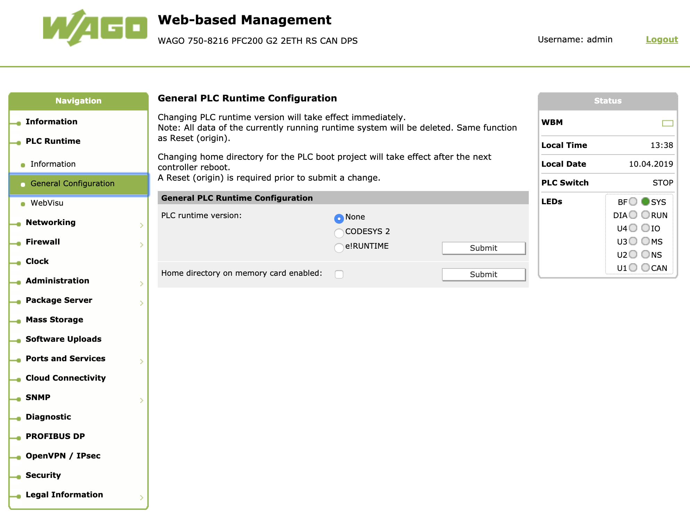
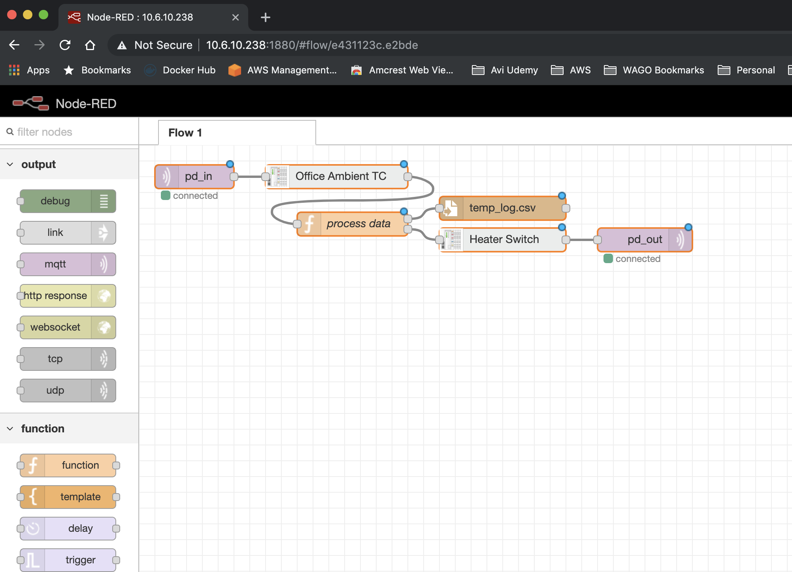

# node-red-contrib-kbus

## These nodes make it easy to read and control the Kbus on the WAGO PFC200 Gen2 controller

    Read and write simple analog, digital, and termpetature sensor modules directly to the Kbus on WAGO PFC200 Generation 2 controllers running Node-RED[2]

## Install

Run the following command in the root directory of your Node-RED install

    npm install node-red-contrib-kbus

Run the following command for global install

    npm install -g node-red-contrib-kbus

## How to use

1. Navigate to Web based management on the controller, go to General Configuration, and select : None.

2. Install the necceasary .ipk files to the PFC by copying them to your controller, opening an SSH terminal on the PFC, and executing:

	    opkg install <path_to_ipk>

Requires [IPK FILES][2] for controller.

Add an MQTT subscribe node to your flow and sibscribe to topic : "pd_in" and wire this to your inputs.  Add an MQTT publish node with topic: "pd_out" and wire this to your outputs.  All MQTT Kbus traffic transmits over port 1883.

See the example flow:

## Authors

[Jesse Cox][3]

[1]:https://nodered.org
[2]:https://github.com/jessejamescox/node-red-contrib-kbus/tree/master/ipk
[3]:https://www.youtube.com/channel/UCXEwdiyGgzVDJD48f7rWOAw
